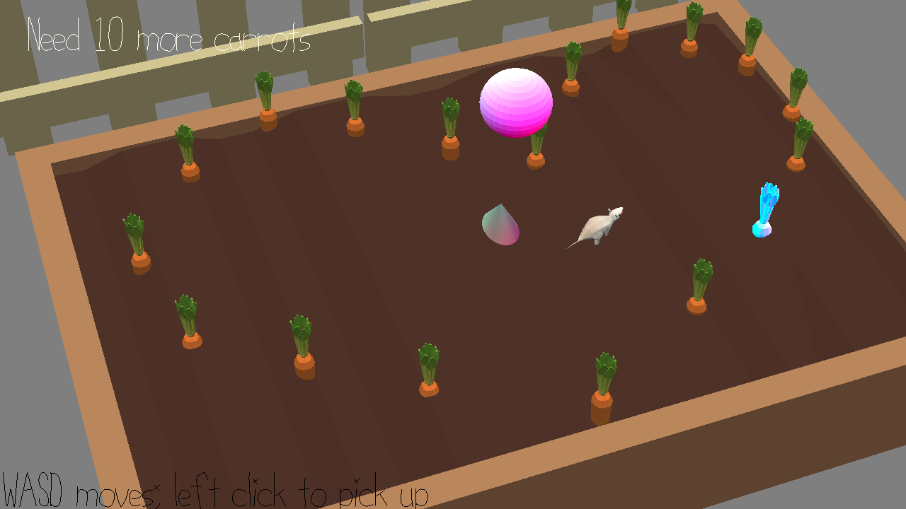

# Music Lottery

Author: Chunan(Oscar) Huang

### Design: 
Carrots are being light-up one by one, along with a music.
Music will stop at the middle, and you need to find out which carrot was light-up when the music stoped.
(find the last light-up carrot when music stops)

### Screen Shot:

### How To Play:

WASD to mouse, left click on mouse to collect carrot.

### Sources: 
##### 3d models:
The main scene is adapted from garden.blend created by Yixin He.
Model Credits: https://github.com/15-466/15-466-f21-base2/blob/main/scenes/CREDITS.txt
##### sound & musics:
correct sound effect:
https://elements.envato.com/victory-DRKGYPE?utm_source=mixkit&utm_medium=referral&utm_campaign=elements_mixkit_cs_sfx_search_no_results&_ga=2.5332721.397766831.1632603381-1120883937.1632603381
wrong sound effect:
https://elements.envato.com/buzzer-wrong-answer-7DCT6NG
music1:
https://www.youtube.com/watch?v=Nz3PYpOcw9U
music2:
https://www.youtube.com/watch?v=fN8wmtbDAqM
music3:
https://www.youtube.com/watch?v=iLBBRuVDOo4

Game developed from base code: https://github.com/15-466/15-466-f21-base3
This game was built with [NEST](NEST.md).

